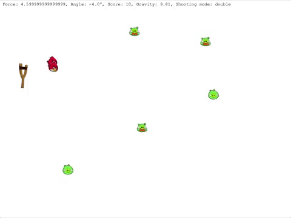

# ADP semestral work - Angry Birds Shooter
Simple cannon shooter with the angry birds theme.

## Features
* Movable cannon with force and angle control
* Simple or realistic missile trajectory
* Single or double shooting mode
* Simple (stationary) or realistic (moving) enemies
* Score counting
* Quick save and load

## Preview

## Technology
The game is a Java Application that is using Maven and JavaFX framework and is putting these patterns into use:

* MVC
* Strategy
* Bridge
* Proxy
* State
* Visitor
* Observer
* Command
* Memento
* Abstract Factory
* Singleton

There are also several tests present.